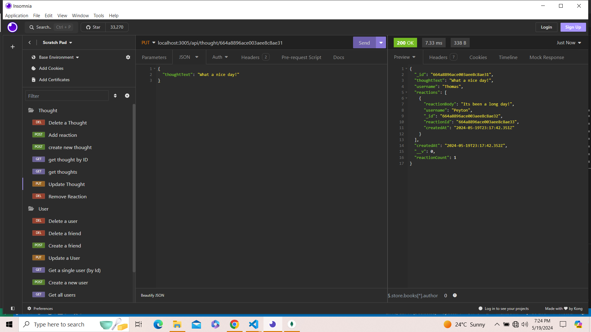

# Challenge-18-Social-Network-API-using-NoSql


## Description

Build an API for a social network web application where users can share their thoughts, react to friends’ thoughts, and create a friend list. 

## User Story

```md
AS A social media startup
I WANT an API for my social network that uses a NoSQL database
SO THAT my website can handle large amounts of unstructured data
```

## Acceptance Criteria

```md
GIVEN a social network API
WHEN I enter the command to invoke the application
THEN my server is started and the Mongoose models are synced to the MongoDB database
WHEN I open API GET routes in Insomnia for users and thoughts
THEN the data for each of these routes is displayed in a formatted JSON
WHEN I test API POST, PUT, and DELETE routes in Insomnia
THEN I am able to successfully create, update, and delete users and thoughts in my database
WHEN I test API POST and DELETE routes in Insomnia
THEN I am able to successfully create and delete reactions to thoughts and add and remove friends to a user’s friend list
```

## Technologies used
* Node.js
* Express.js
* Mongoose
* Insomnia
* JavaScript


## Getting started
* use npm init to create a package.json file where you will create some information about the dependencies, script you will use. 
* run npm i to install all the packages. 
* run npm seed to seed all the data. 
* run npm start
* use Insomnia to make changes in the data


## Screenshots of the functionalities

* to get all users


* to get a single user by Id


* create a new user


* update an existing user


* delete an existing user


* add a friend to the user


* delete a friend from user's friend list


* get all thoughts


* get a single thought by Id


* update an existing thought



* create a new thought


* delete an existing thought


* add a reaction


* delete a reaction


## Walkthrough Video: 